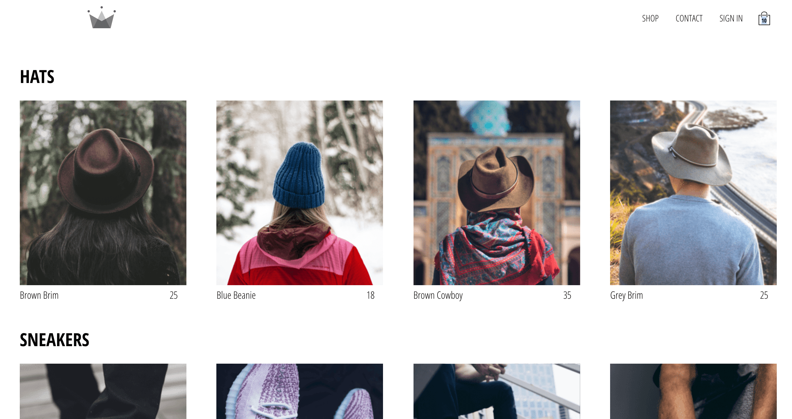

# 😛 About this project

This project was created to study and apply concepts of React architecture and development.

Here is a preview of what you should see if you run it.

# 😮 Available Scripts

In the project directory, you can run:

### `yarn start`

Runs the app in the development mode. 
Open [http://localhost:3000](http://localhost:3000) to view it in the browser.

The page will reload if you make edits. 
You will also see any lint errors in the console.

## `yarn build`

Builds the app for production to the `build` folder. 
It correctly bundles React in production mode and optimizes the build for the best performance.

The build is minified and the filenames include the hashes. 
Your app is ready to be deployed!

See the section about [deployment](https://facebook.github.io/create-react-app/docs/deployment) for more information.

# 😊 Contributing

The intent for this project is to be constantly updated and refactored as a way to learn web frontend architecture best practices. Feel free to suggest changes if you want to.